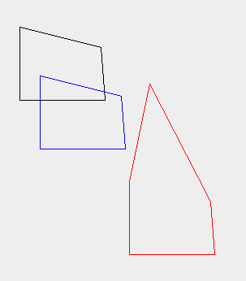
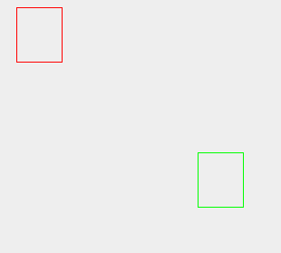

# TP1 Compte Rendu
> Guillaume ZHANG Xiaofeng 21/04/2021
[toc]

## Question 1
On a fait ensemble la class `Point` pendant le cours. Je n'ai pas fait de modifications.
```java
//Classe Point

public class Point {
    protected int x;
    protected int y;
    
    public Point(int a,int b) {
        x=a;
        y=b; // Constructeur d'un point ayant les coordonnées passées en paramètres
    }
    
    public Point(Point p) {
        x=p.getX();
        y=p.getY(); // Constructeur d'un point ayant les mêmes coordonnées que le point p
    }
    
    public int getX() {
        return x; // retourne l'abscisse du point
    }
    
    public int getY() {
        return y; // retourne l'ordonnée du point
    }
    
    public void translater(int a,int b) {
        x=x+a;
        y=y+b;// change les coordonnées du point
    }
    public Point translaterP(int a,int b) {
        return new Point(x+a,y+b);// crée un nouveau point (copie du point) translaté
    }
    public String toString() {
        return("abscisse : "+x+", ordonnée : "+y);
        // La méthode toString() est définie dans la classe Object dont toute classe java hérite
        // elle est redéfinie ici pour renvoyer une chaîne de caractères qui décrit bien l'objet.
    }
}
```
*****************************************************
## Question 2
```java
// Class Segment0

import java.util.Vector;

public class Segment0 {
	protected Vector<Point> vectP;
	
	public Segment0(){
		vectP = new Vector<Point>();
	}

	public Segment0(Segment0 seg){
		vectP = new Vector<Point>();
		for(Point p : seg.getVectP()){
			this.vectP.add(new Point(p));
		}
	}

	public Segment0(Point p1, Point p2){
		vectP = new Vector<Point>();
		this.vectP.add(p1);
		this.vectP.add(p2);
	}

	public Point getExtremite(int i) {
		return vectP.get(i-1);
	}
		
	public Vector<Point> getVectP() {
		return vectP;
	}
		
	public void translater(int a, int b){
		for (Point p : vectP) {
			p.translater(a,b);
		}
	}
		
	public Segment0 translaterS(int a, int b){
		for (Point p : vectP) {
			p.translater(a,b);
		}
		return new Segment0(this);
	}
		
	public void ajouterSommet(Point p) {
        this.vectP.add(new Point(p));
	}
}
```
***********************************************************
## Question 3
### Question 3.0
Test de la classe `Test` succès. On obtient le même graphique que dans le sujet.
### Question 3.1
La classe `Polygone` hérite de la classe `ObjetGraphique`.

J'ai proposé trois constructeurs différents. L'un pour initialisation vide, l'un pour copier un polygone, l'un pour créer un polygone avec 4 sommets (Cette dernière constructeur est prévenu pour la question bonus).

J'ai override la méthode `dessinerObjet` pour qu'un polygone s'affiche.
```java
// Class Polygone

import java.awt.* ;
import java.util.Vector;

public class Polygone extends ObjetGraphique {
    protected Vector<Point> vectP;

    public Polygone(){
        vectP = new Vector<Point>();
    }

    public Polygone(Polygone poly){
        vectP = new Vector<Point>();
        for(Point p : poly.getVectP()){
            this.vectP.add(new Point(p));
        }
    }

    public Polygone(Point p1, Point p2, Point p3, Point p4){
        vectP = new Vector<Point>();
        this.vectP.add(p1);
        this.vectP.add(p2);
        this.vectP.add(p3);
        this.vectP.add(p4);
    }

    public Vector<Point> getVectP() {
        return vectP;
    }

    public void translater(int a, int b){
        for (Point p : vectP) {
            p.translater(a,b);
        }
    }

    public void ajouterSommet(Point p) {
        vectP.add(new Point(p));
    }

    public void dessinerObjet(Graphics g){
        int i;
        for (i=0;i<vectP.size()-1;i++){
            ligne(g, vectP.get(i).getX(),vectP.get(i).getY(),vectP.get(i+1).getX(),vectP.get(i+1).getY());
        }
        ligne(g, vectP.get(i).getX(),vectP.get(i).getY(),vectP.get(0).getX(),vectP.get(0).getY());
    }
}
```
### Question 3.1
La classe `PolygoneColore` hérite de la classe `Polygone`.

Pour les constructeurs, j'ai utiliser `super(arguments...)` et rajouté un nouveau argument `couleur`.

La méthode `dessinerObjet` est identique que celle de `Polygone`. Il ne faut la réécrire.

Il faut attacher la couleur au graphique. Donc la méthode `colorerObjet`.

```java
// Class PolygoneColore

import java.awt.* ;
import java.util.Vector;

public class PolygoneColore extends Polygone {
    protected Color color;

    public PolygoneColore(){
        super();
    }

    public PolygoneColore(Polygone poly,Color couleur){
        super(poly);
        color = couleur;
    }
    public PolygoneColore(Point p1, Point p2, Point p3, Point p4,Color couleur){
        super(p1,p2,p3,p4);
        color = couleur;
    }

    public void colorerObjet(Graphics g){
        g.setColor(color);
    }
}
```
On teste les deux classes concernant des polygones. On obtient un graphique dessous.

******************************************
## Question bonus
La classe `RectangleColore` hérite de la classe `PolygoneColore`.

Il ne faut que réécrire les constructeurs. D'autres méthodes sont identiques que celles dans `PolygoneColore`.

On doit faire attention à ce que c'est un rectangle. Un rectangle peut être défini en utilisant ces deux sommets à face. (Je ne sais pas comment dire en français mais je suis sûr que vous comprenez l'idée.)

```java
// Class Rectangle

import java.awt.* ;
import java.util.Vector;

public class RectangleColore extends PolygoneColore {
    protected Vector<Point> vectP;
    protected Color color;

    public RectangleColore(){
        super();
    }

    public RectangleColore(Point a, Point b, Color couleur){
        //super(a,b);
        super(new Point(a),new Point(a.getX(),b.getY()),new Point(b),new Point(b.getX(),a.getY()),couleur);
    }

    public RectangleColore(RectangleColore rect, Color couleur){
        super(rect, couleur);
    }
}
```
Les rectangles colorés affichés sont dans la figure dessous.
